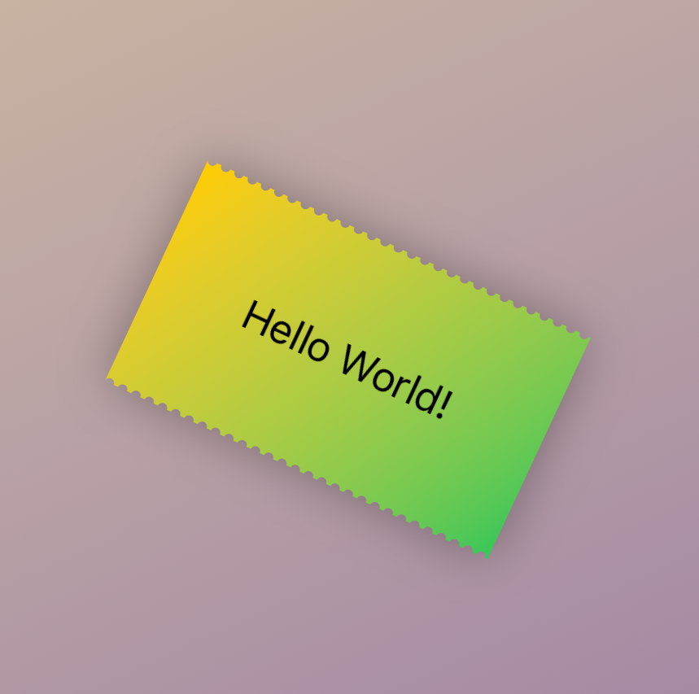

# PostMark View

## Installation

Add as a swift package

## Code example

```swift 
struct ContentView: View {
    var body: some View {
        ZStack {
            LinearGradient(colors: [.yellow, .purple], startPoint: .topLeading, endPoint: .bottomTrailing)
                .ignoresSafeArea()
                .saturation(0.4)

            PostMarkView(
                background: .linearGradient(colors: [.yellow, .green], startPoint: .topLeading, endPoint: .bottomTrailing),
                dotSize: 4.0,
                dotSpacing: 2.0,
                edges: [.top, .bottom])
            {
                Text("Hello World!")
                    .padding(40.0)
            }
            .shadow(radius: 10)
            .rotationEffect(.degrees(25))
        }
    }
}

```

## Screenshots

